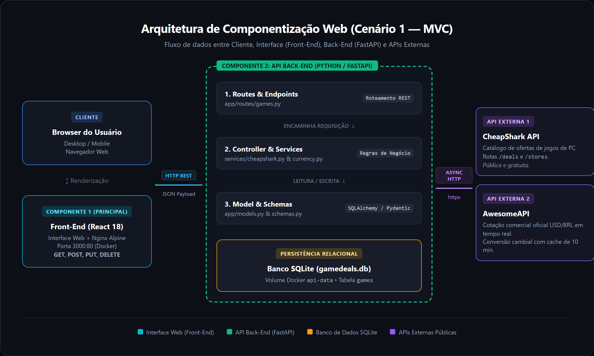
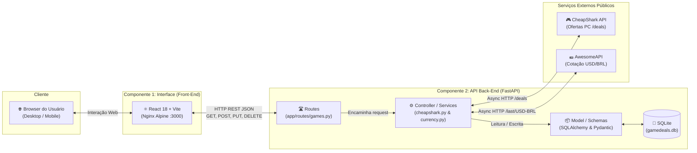

# GameDeals Vault API — Back-End

API REST desenvolvida em **Python (FastAPI)** para consulta de ofertas de jogos digitais de PC em diversas lojas (Steam, Epic Games Store, GOG, Fanatical, etc.) e gerenciamento da colecao pessoal / backlog do jogador, com persistencia em **SQLite** e conversao de moedas em tempo real via **AwesomeAPI**.

Este projeto compoe o **Modulo Back-End (API Secundaria)** do MVP da PUC Minas para a disciplina de Arquitetura de Sistemas Web e Componentizacao.

---

## Arquitetura do Sistema (Cenário 1 — MVC)

Conforme estabelecido nos requisitos do edital, a solução implementa a arquitetura de módulos baseada no **Cenário 1**, sumarizando todos os componentes utilizados:





---

## Sumário
- [Arquitetura do Sistema (Cenário 1 — MVC)](#arquitetura-do-sistema-cenário-1--mvc)
- [Recursos Principais](#recursos-principais)
- [Tecnologias Utilizadas](#tecnologias-utilizadas)
- [Integração com APIs Externas (CheapShark e AwesomeAPI)](#integracao-com-apis-externas-cheapshark-e-awesomeapi)
- [Estrutura de Pastas](#estrutura-de-pastas)
- [Como Executar Localmente](#como-executar-localmente)
- [Como Executar via Docker](#como-executar-via-docker)
- [Documentação das Rotas (Swagger)](#documentacao-das-rotas-swagger)

---

## Recursos Principais
* **Consumo e Tratamento da CheapShark API:** Busca promocoes em tempo real, mapeando IDs de lojas para nomes amigaveis e calculando percentuais de economia.
* **Conversao Cambial com AwesomeAPI:** Consulta automatica da cotacao oficial do Dolar comercial (USD -> BRL), convertendo precos e economia para Reais (R$) com cache em memoria.
* **CRUD Completo de Colecao:** Operacoes completas com os metodos HTTP `GET`, `POST`, `PUT` e `DELETE`.
* **Metricas Consolidadas (USD e BRL):** Calculo automatico do total economizado em dolares ($) e em reais (R$), media percentual de descontos e contagem de titulos por status (`wishlist`, `backlog`, `playing`, `completed`).
* **Documentacao Swagger Interativa:** Interface OpenAPI 3 pronta para testes de todas as rotas em `/docs`.
* **Persistencia Relacional:** Utilizacao do SQLite via SQLAlchemy.

---

## Tecnologias Utilizadas
* **Python 3.12**
* **FastAPI 0.110+** (Framework Web de alta performance com OpenAPI/Swagger nativo)
* **Uvicorn** (Servidor ASGI ultrarrapido)
* **SQLAlchemy 2.0+** (ORM para modelagem e persistencia em SQLite)
* **Pydantic 2.6+** (Validacao e serializacao de dados)
* **HTTPX** (Cliente HTTP assincrono para comunicacao com APIs externas)
* **Docker** (Containerizacao para isolamento e facil deploy)

---

## Integracao com APIs Externas (CheapShark e AwesomeAPI)

A aplicacao integra dois servicos publicos e gratuitos:

### 1. CheapShark API (Ofertas de Jogos)
* **URL:** `https://apidocs.cheapshark.com/`
* **Licenca:** Gratuita e publica para desenvolvedores.
* **Cadastro:** Nao requer conta nem chave de API.
* **Rotas Utilizadas:** `GET /deals` e `GET /stores`.
* **Identificacao:** Cabecalho `User-Agent: GameDealsVault/1.0 (puc-mvp-estudante@pucminas.br)`.

### 2. AwesomeAPI (Cotacao Dolar para Real)
* **URL:** `https://economia.awesomeapi.com.br/last/USD-BRL`
* **Licenca:** Gratuita, sem chave e sem autenticacao.
* **Rotas Utilizadas:** `GET /last/USD-BRL`.
* **Tratamento dos Dados:** A API aplica a taxa atual aos precos normais, promocionais e aos calculos de economia antes de devolver a resposta ao Front-End, mantendo cache com TTL de 10 minutos.

---

## Estrutura de Pastas

```text
gamedeals-api/
├── app/
│   ├── __init__.py
│   ├── database.py         # Configuracao do engine e sessao SQLite
│   ├── main.py             # Instancia do FastAPI, CORS e inclusao de rotas
│   ├── models.py           # Modelo ORM GameItem do SQLAlchemy
│   ├── schemas.py          # Schemas Pydantic para validacao e serializacao
│   ├── routes/
│   │   ├── __init__.py
│   │   └── games.py        # Endpoints REST (GET, POST, PUT, DELETE)
│   └── services/
│       ├── __init__.py
│       ├── cheapshark.py   # Integracao e tratamento com CheapShark API
│       └── currency.py     # Integracao e cache com a AwesomeAPI
├── .dockerignore
├── Dockerfile              # Instrucoes de conteiner da API
├── README.md               # Documentacao detalhada deste repositorio
├── requirements.txt        # Dependencias Python
└── test_api.py             # Script de validacao automatizada
```

---

## Como Executar Localmente

### Pre-requisitos
* Python 3.10 ou superior instalado.
* Git instalado.

### Passo a Passo

1. **Clone o repositorio:**
   ```bash
   git clone <URL_DO_REPOSITORIO_API>
   cd gamedeals-api
   ```

2. **Crie e ative um ambiente virtual:**
   ```bash
   # Windows (PowerShell)
   python -m venv venv
   .\venv\Scripts\Activate.ps1

   # Linux / macOS
   python3 -m venv venv
   source venv/bin/activate
   ```

3. **Instale as dependencias:**
   ```bash
   pip install -r requirements.txt
   ```

4. **Inicie o servidor de desenvolvimento:**
   ```bash
   uvicorn app.main:app --reload --host 0.0.0.0 --port 8000
   ```

5. **Acesse a API e a documentacao interativa:**
   * Health Check: [http://localhost:8000/](http://localhost:8000/)
   * **Swagger UI:** [http://localhost:8000/docs](http://localhost:8000/docs)
   * **ReDoc:** [http://localhost:8000/redoc](http://localhost:8000/redoc)

---

## Como Executar via Docker

Para rodar o conteiner isolado da API:

1. **Construa a imagem Docker:**
   ```bash
   docker build -t gamedeals-api .
   ```

2. **Execute o conteiner mapeando a porta 8000:**
   ```bash
   docker run -d -p 8000:8000 --name gamedeals-api-container gamedeals-api
   ```

3. **Acesse a documentacao:**
   Abra no navegador: [http://localhost:8000/docs](http://localhost:8000/docs)

4. **Para parar o conteiner:**
   ```bash
   docker stop gamedeals-api-container && docker rm gamedeals-api-container
   ```

---

## Documentacao das Rotas (Swagger)

A API disponibiliza os seguintes endpoints REST:

| Metodo | Endpoint | Descricao |
| :--- | :--- | :--- |
| `GET` | `/api/currency/rate` | Retorna a cotacao oficial do Dolar (USD -> BRL) em tempo real da AwesomeAPI com informacoes de cache. |
| `GET` | `/api/external/deals` | Consulta promocoes em tempo real na CheapShark API com tratamento de dados e conversao para BRL. |
| `GET` | `/api/games` | Lista todos os jogos cadastrados na colecao com filtros (`status_filter`, `search`, `sort_by`), cotacao atual e metricas em USD e BRL. |
| `POST` | `/api/games` | Cadastra um novo jogo na colecao/wishlist no banco SQLite. |
| `PUT` | `/api/games/{id}` | Atualiza status (`wishlist`, `backlog`, `playing`, `completed`), avaliacao (1-5) e anotacoes. |
| `DELETE` | `/api/games/{id}` | Remove definitivamente o jogo da colecao do banco de dados. |
